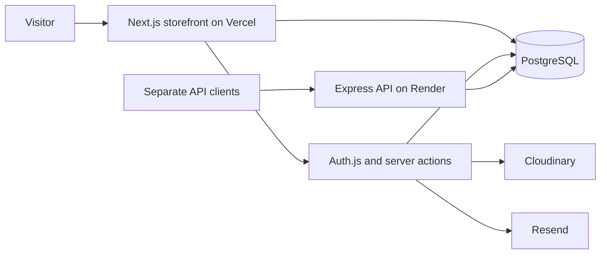

<div align="center">


# Advik Furniture

**A furniture storefront with cinematic design, a 3D showroom, and catalog administration.**

[Visit the public website](https://advikfurniture.vercel.app) · [Deployment guide](docs/DEPLOYMENT.md) · [Project review](docs/PROJECT_REVIEW.md) · [Report a bug](https://github.com/rahulpoddar798/advikfurniture/issues/new/choose)

[](https://github.com/rahulpoddar798/advikfurniture/actions/workflows/ci.yml)


</div>

## Overview

Advik Furniture combines product discovery, accounts, and catalog management. The Next.js app reads PostgreSQL directly through Prisma and handles authentication and mutations with server actions. A separate Express API offers catalog endpoints and JWT authentication.

The [live storefront](https://advikfurniture.vercel.app) is accessible without a Vercel account. Customer settings and administration require application sign-in.

> **Current scope:** checkout and newsletter submission are demonstrations. Checkout does not persist orders or charge payments; newsletter submission does not subscribe users. Remaining commerce work is described in the [project review](docs/PROJECT_REVIEW.md).

## Contents

- [Features](#features)
- [Architecture](#architecture)
- [Local setup](#local-setup)
- [Commands](#commands)
- [Deployment](#deployment)
- [Contributing](#contributing)

## Features

| Area | Implemented behavior |
| --- | --- |
| Storefront | Featured products, collections, category browsing, search, product details |
| Experience | Responsive layouts, light/dark themes, animations, interactive 3D showroom |
| Accounts | Credentials and Google sign-in, profiles, addresses, password reset, wishlist, notification preferences |
| Administration | Role-restricted dashboard, catalog/category management, image uploads, customer and order views |
| Integrations | Prisma/PostgreSQL, Cloudinary, Resend password-reset email, Vercel analytics |
| Discovery | Page metadata, robots rules, database-backed sitemap |

Google, Cloudinary, and email features need provider credentials. Order views do not imply that demo checkout creates orders.

## Architecture



The storefront's catalog and server actions do not depend on the Express API. Auth.js sessions and Express bearer tokens are separate authentication mechanisms.

```text
advikfurniture/
├── frontend/
│   ├── app/                 # Storefront, accounts, admin, server actions
│   ├── components/          # Shared UI and 3D showroom
│   ├── lib/                 # Database, catalog, email, media, site URLs
│   ├── prisma/              # Schema and migrations
│   ├── public/              # Brand assets
│   └── .env.example         # Frontend configuration template
├── backend/
│   ├── src/                 # Express routes, controllers, access checks
│   ├── tests/               # Access regression tests
│   ├── prisma/              # Shared schema and migrations
│   └── .env.example         # API configuration template
├── docs/                    # Deployment guide and project review
├── .github/                 # CI, issue forms, pull request template
└── render.yaml              # Render backend Blueprint
```

## Local setup

### 1. Prerequisites

- Node.js **22.x** (the verified local version is pinned in `.nvmrc`).
- npm and Git.
- A PostgreSQL database you can connect to and migrate.

### 2. Clone

```bash
git clone https://github.com/rahulpoddar798/advikfurniture.git
cd advikfurniture
```

### 3. Configure the frontend

```bash
cd frontend
npm ci
```

Copy `.env.example` to `.env`: use `cp .env.example .env` in Bash or `Copy-Item .env.example .env` in PowerShell. Set `DATABASE_URL`, `DIRECT_URL`, and a unique `AUTH_SECRET`.

Generate a secret:

```bash
node -e "console.log(require('crypto').randomBytes(32).toString('base64'))"
```

Use `http://localhost:3000` for `AUTH_URL` and `NEXT_PUBLIC_APP_URL`. See the example file and [deployment guide](docs/DEPLOYMENT.md) for optional integrations.

### 4. Apply migrations and run

```bash
npm exec prisma generate
npm run prisma:migrate
npm run dev
```

Open [localhost:3000](http://localhost:3000). A fresh database has an empty catalog. Create an account, have a trusted database operator assign the required administrator role, and add categories and published products in `/admin`. Maintenance promotion scripts contain hardcoded targets; review them before use.

**Existing seed scripts delete data. Do not run them against production.** Setup does not execute a seed or create a default administrator.

### 5. Optional: run the API

In a second terminal, from the repository root:

```bash
cd backend
npm ci
```

Copy `.env.example` to `.env`. Set database URLs and a separate `JWT_SECRET` with at least 32 characters.

```bash
npm run dev
```

Open [localhost:5000/health](http://localhost:5000/health). If both services share a database, apply their identical migration history once. Product write endpoints require an Express-issued bearer token belonging to a current administrator.

## Commands

Run commands inside the corresponding service directory.

| Command | Frontend | Backend |
| --- | --- | --- |
| `npm ci` | Install locked dependencies | Install dependencies and generate Prisma client |
| `npm run dev` | Next.js development server | Express development server |
| `npm run build` | Generate client and build Next.js | Generate client and compile TypeScript |
| `npm start` | Serve production build | Apply migrations and serve API |
| `npm run typecheck` | Check TypeScript | Check TypeScript |
| `npm run lint` | Full ESLint check | Not configured |
| `npm test` | Not configured | Build and run access tests |
| `npm run prisma:migrate` | Apply committed migrations | Apply committed migrations |

CI builds both services, checks types and matching Prisma schemas/migrations, and runs backend access tests. Existing frontend lint findings are recorded in the project review.

## Deployment

| Component | Configuration |
| --- | --- |
| Public storefront | [advikfurniture.vercel.app](https://advikfurniture.vercel.app) |
| Frontend hosting | Vercel; root directory `frontend`; production branch `main` |
| Optional API hosting | Render; root directory `backend`; Blueprint `render.yaml` |
| Database | PostgreSQL; pooled runtime URL and direct migration URL when needed |

Follow the [deployment guide](docs/DEPLOYMENT.md) for environment variables, migrations, public access checks, and troubleshooting. Share the storefront URL with visitors; deployment-dashboard links are for maintainers.

## Contributing

Read [CONTRIBUTING.md](CONTRIBUTING.md), use issue forms for bugs and features, and include validation results in pull requests. Report vulnerabilities privately as described in [SECURITY.md](SECURITY.md).

## License

No open-source license has been selected. Public visibility does not grant redistribution rights to the code or brand assets. Contact the repository owner for reuse permission.
